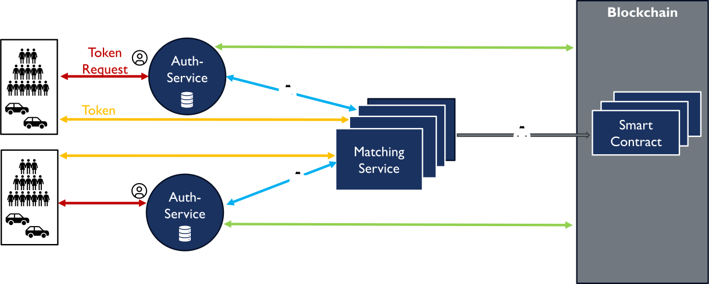

# SofDCar Hackathon II: *Privacy visualization of a decentralized ride-pooling platform* (Privacy Drifters)

This code was originally created in the [SofDCar Hackathon II](https://sofdcar.de/language/en/sofdcar-hackathon-ii-2/) with the topic *Privacy visualization of a decentralized ride-pooling platform* brought by the University of Stuttgart and the Karlsruhe Institute of Technology.

> Your team works with a decentralized ride-pooling platform that focuses on privacy aspects. Ride pooling provides the ability to book rides, similar to a cab service.
> Rides are pooled to reduce costs and trips.
> As a team, you have the task of developing a visualization of the available data as a web app.

## Instructions

Start the program by going into the [`sofd-frontend`](./sofd-frontend) directory ([`node-js`/`npm`](https://nodejs.org/en/download) need to be installed) and run:

```sh
# Install the necessary dependencies
npm install --force
# Start the web app server on a local port
npm run start
```

The application can then be viewed on `http://localhost:3000/`.

## The decentralized ride-pooling platform that is visualized



There are 2 parties in the ride-pooling platform: People that provide rides and people that request rides.

Both parties first need to authenticate to an ***Authentication Service (AS)*** that stores **AS1) their contact details** and returns each authentication a token/pseudonym to them to use the service.
This **AS2) list of pseudonyms** is also stored by the AS.
A party can never be part of more than one AS and if they want to change all the stored data is moved to the new AS, typically there is one AS per country.

Given this token/pseudonym a party can now use a local ***Matching Service MS*** which can overlap with each other.
Each party requests in a bid with their pseudonym and location a match that can also contain additional filters like the past average rating.
While the MS does only know the pseudonyms of each party it can request the AS for it since the AS knows the list of pseudonyms and can thus read it from the public blockchain.
If both parties agree to the match a smart contract is created and put on a public blockchain which contains the pseudonyms of both parties and eventually a rating from both parties of each other.

The blockchain itself is public knowledge but only contains the smart contracts with the pseudonyms and ratings so the only one who can read it is a party that knows its past list of pseudonyms or the AS that stores this list.
Since each time you authenticate you get a new pseudonym nobody can easily trace back your rides and ratings, even if they would find out about one pseudonym of a party.

## TODO

Things that can still be done:

- [ ] Add better data to visualize the 2 parties without hardcoded objects
- [ ] Add live updates (make the parties move themselves across the map)
- [ ] Fix weird npm/node bug that prevents `npm install` from working without `--force`
- [ ] Fix weird bug that makes generated routes unusable when deploying as static website since the routes have no `index.html` website

## Given project resources

- A previous developed similar frontend: [TES-SS22-VisualizingConfidentialityInMobilitySystems](https://github.com/KASTEL-MobilityLab/TES-SS22-VisualizingConfidentialityInMobilitySystems)
- related code/data structures can be found on the branch `chain-code`
